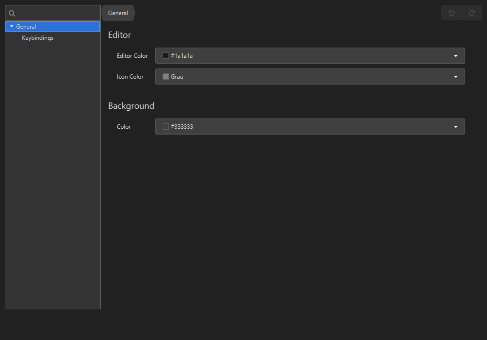

# viro

<div align="center">
  <a href="https://www.oracle.com/java/">
    
  </a>
  <a href="https://clientastisch.github.io/viro/docs" target="_blank">
    
  </a>
</div>

## :books: Introduction

Viro is a Java doodle application. It is based on the [Spring](https://spring.io/) framework and uses JavaFX for rendering.


---

## :mag_right: Compatibility

- [x] [Windows](https://www.microsoft.com/)
- [x] [Java 8](https://github.com/AdoptOpenJDK/openjdk-jdk8u)

## :ballot_box: Installation

To use viro, you must have Java installed or use the bundled zip available on the release tab.

In case you downloaded the source and want to compile it, make sure to run

```js
mvn package -DskipTests=true -f pom.xml
```

## :gear: Settings

Viro uses [PreferenceFx](https://github.com/dlsc-software-consulting-gmbh/PreferencesFX) to store, display and load settings. You Also have the possibility to set your own keybindings.



## :safety_pin: Default Settings

### :heavy_check_mark: Show

```
ALT + PAUSE
```

### :x: Hide

```
ESC
```